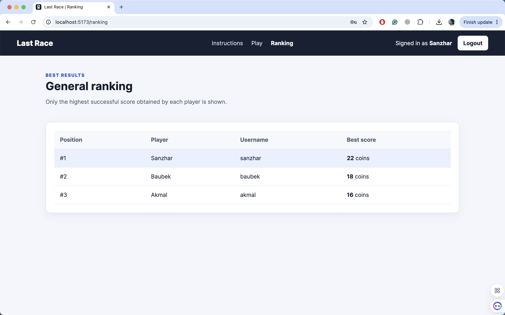
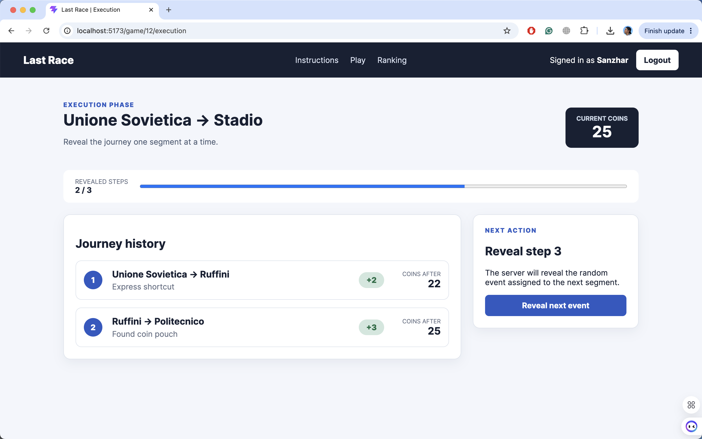

# Exam #1: "Last Race"
## Student: s123456 BALTABEKOV SANZHAR 

Last Race is a single-player underground route-planning game developed with React 19, Express, Passport.js, session cookies, and SQLite.

## React Client Application Routes

- Route `/`: public page containing the game instructions. Anonymous users cannot see the underground network or access game functionality.
- Route `/login`: login page for registered users.
- Route `/setup`: protected page showing the complete underground network and allowing the user to start a new game.
- Route `/ranking`: protected page showing each user's best successful game score.
- Route `/game/:gameId/planning`: protected planning phase for the game identified by `gameId`. It shows the assigned stations, station-only map, available segments, selected route, and countdown.
- Route `/game/:gameId/execution`: protected execution phase for the game identified by `gameId`. It reveals the journey events one step at a time and updates the player's coins.
- Route `/game/:gameId/result`: protected result page showing the final score and the journey summary when the submitted route was valid.
- Any unknown route redirects the user to the instructions page.

## API Server

Except for the health check and login API, all endpoints require an authenticated session.

- GET `/api/health`
  - Returns `{ "status": "ok" }` to confirm that the server is running.
- POST `/api/sessions`
  - Receives `{ "username": string, "password": string }`.
  - Authenticates the user and returns their public user information.
- GET `/api/sessions/current`
  - Returns the currently authenticated user's public information.
- DELETE /api/sessions/current
  - Logs out the current user, destroys the session, and returns HTTP status `204`.
- GET `/api/network`
  - Returns the underground lines, stations, station-line associations, interchange information, coordinates, and connected segments.
- GET `/api/rankings`
  - Returns the registered users who completed at least one successful game, together with their best score, ordered by score.
- POST `/api/games`
  - Creates a new game for the authenticated user.
  - Returns the game identifier, randomly assigned start and destination stations, starting coins, and planning deadline.
- POST `/api/games/:gameId/route`
  - Receives `{ "segmentIds": number[] }` containing the selected segments in travelling order.
  - Validates ownership, deadline, segment reuse, continuity, line changes, start, and destination, then returns the game state or a score of zero for an invalid route.
- POST `/api/games/:gameId/next-step`
  - Reveals the next unrevealed segment event for the specified game.
  - Returns the event, its coin effect, the updated coin total, journey progress, and the final result when execution is complete.

## Database Tables

- Table `users`: stores registered users, usernames, names, password hashes, and password salts.
- Table `lines`: stores the unique names and display colours of the underground lines.
- Table `stations`: stores station names and coordinates used to draw the network map.
- Table `station_lines`: associates stations with lines and identifies the order of stations on each line.
- Table `segments`: stores direct connections between two stations and the line serving each connection.
- Table `events`: stores the possible journey-event descriptions and their coin effects.
- Table `games`: stores the game owner, assigned stations, timestamps, current status, validity, and final score.
- Table `game_steps`: stores the ordered segments, assigned random events, running coin totals, and reveal status for valid routes.

## Main React Components

- `App` (in `App.jsx`): defines the application routes and connects public pages, protected pages, and the common layout.
- `AuthProvider` (in `auth/AuthProvider.jsx`): restores the authenticated session and provides login, logout, user, and loading state to the application.
- `AppLayout` (in `layout/AppLayout.jsx`): renders the shared application structure, navigation links, current-user information, and logout action.
- `ProtectedRoute` (in `components/ProtectedRoute.jsx`): prevents anonymous users from accessing protected routes and redirects them to the login page.
- `NetworkMap` (in `components/NetworkMap.jsx`): renders the underground network as an SVG map and supports both the complete-network and station-only views.
- `SetupPage` (in `pages/SetupPage.jsx`): loads the complete network, displays the setup screen, and creates a new game.
- `PlanningPage` (in `pages/PlanningPage.jsx`): manages the countdown, ordered segment selection, route editing, manual submission, and automatic submission when time expires.
- `ExecutionPage` (in `pages/ExecutionPage.jsx`): reveals one journey event at a time and updates the current number of coins and journey progress.
- `ResultPage` (in `pages/ResultPage.jsx`): displays the final score and, for successful games, the completed journey summary.
- `RankingPage` (in `pages/RankingPage.jsx`): retrieves and displays the general ranking based on each user's best successful score.

## Screenshot

# General Ranking Page

# Game in Progress

## Users Credentials

- sanzhar, 23012005
- baubek, 0407200
- akmal, 09112006

## Use of AI Tools
ChatGPT was used to clarify the exam requirements, discuss application architecture, suggest implementation approaches, assist with debugging and testing, and help prepare the documentation.

All AI-generated suggestions were reviewed and adapted to the actual project structure. The resulting application was verified through ESLint, a Vite production build, Node.js syntax checks, direct API testing, browser-based game-flow testing, and SQLite database inspection.
